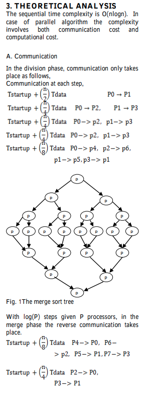
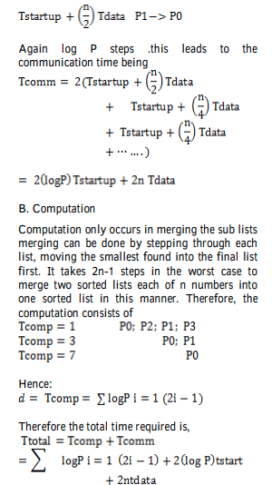

# TET Proyecto 4

## 1. Título

2V1R

## 2. Integrantes

- Santiago Arredondo Quintero - sarredondq@eafit.edu.co
- Kevyn Santiago Gómez Patiño - ksgomezp@eafit.edu.co
- Camilo Gaviria Castrillón - cgavir29@eafit.edu.co

## 3. GitHub y Carpeta Drive

- [GitHub](https://github.com/cgavir29/TET-Proyecto-4)
- [Carpeta Drive](https://drive.google.com/drive/folders/1piiqewvpliQUFRVZYRBsc58DWFiEK1KA?usp=sharing)

## 4. Ideas Preliminares de Proyecto 4

- Paralelizar un algoritmo de ordenamiento
- Paralelizar un algoritmo de búsqueda

## 5. Problema o Caso de Estudio a Resolver

Merge Sort Paralelo

Se realizo un proceso de investigación para determinar si el algoritmo era débilmente acoplado y por tanto apto para MPI. En el paper _**"Analysis of parallel merge sort algorithm"**_ de Manwade, K. B. (2010) se evidencia la implementación de éste en un ambiente MPI y su evaluación de desempeño como algoritmo débilmente acoplado.

## 6. Objetivos y Alcance

Implementar el algoritmo utilizando buenas prácticas y asegurando un funcionamiento correcto y un nivel de paralelismo acorde a las técnicas utilizadas que puedan llegar a reducir el tiempo de ejecución con un objetivo de reducción del 30%, comparándolo con el algoritmo ejecutado con una implementación secuencial que obedece una complejidad de O(nlogn).

## 7. Requerimientos Técnicos

Conocer los conceptos de paralelismo en Arquitectura de Intel y la estructura y funcionamiento del algoritmo en un ambiente pararelo.

Los fundamentos matemáticos para el calculo de los tiempos de comunicación y procesmiento del algoritmo (Merge Sort) paralelo es explicado por Manwade, K. B. (2010) en las imágenes que se observan a continuación.

  

## 8. Dominio y rango de los datos

- El dominio de los datos de nuestro problema serán los números enteros de un arreglo ingresados por un documento de texto.
- El rango de los datos serán números enteros de un arreglo escritos en un documento de texto.

## 9. Plan de Trabajo

- Entendimiento del algoritmo -> Kevyn
- Implementación secuencial -> Kevyn
- Diseño de implementación paralela -> Santiago
- Implementación del algoritmo paralelizado -> Santiago
- Comparación y toma de métricas -> Camilo
- Mejoras y optimización -> Camilo

## 11. Código de Honor

> Yo **Santiago Arredondo Quintero** declaro que el contenido de este proyecto es un trabajo original del equipo **2V1R** y la documentación en la que me he guiado está explícitamente referenciada o citada.
> Yo **Kevyn Santiago Gómez Patiño** declaro que el contenido de este proyecto es un trabajo original del equipo **2V1R** y la documentación en la que me he guiado está explícitamente referenciada o citada.
> Yo **Camilo Gaviria Castrillón** declaro que el contenido de este proyecto es un trabajo original del equipo **2V1R** y la documentación en la que me he guiado está explícitamente referenciada o citada.

## 12. Referencias

[1] Manwade, K. B. (2010). Analysis of parallel merge sort algorithm. International Journal of Computer Applications, 1(19), 66-69.

[2] Khan, H. U., & Tiwari, R. (2012). An adaptive framework towards analyzing the parallel merge sort. International Journal of Science and Research (IJSR), 1(2).

[3] http://rosalind.info/problems/ms/

[4] https://www.coursera.org/learn/parallelism-ia
