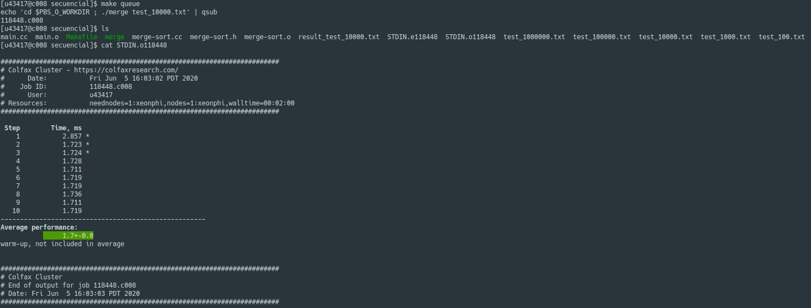

# TET Proyecto 4

## 1. Link Drive

https://drive.google.com/drive/folders/1piiqewvpliQUFRVZYRBsc58DWFiEK1KA?usp=sharing

## 2. Link videos

- Kevyn Santiago Gómez Patiño:
https://www.youtube.com/watch?v=gjFhn1QloPc&feature=youtu.be

## 3. Algoritmo Secuencial

### 3.1. Descripción del Algoritmo

Se tiene inicialmente un documento de texto de entrada donde se contiene el arreglo de números de enteros que van a ser ordenados.
Se procesa este archivo y se almacenan los datos en un arreglo y este se envía al algoritmo merge sort para empezar su procesamiento.

El algoritmo sigue de la siguiente forma:

- Si la longitud del arreglo es 0 ó 1 ya estaba ordenado entonces no se realiza ningún otro procedimiento. Si no es así se ejecutan los siguientes puntos.
- Se divide el arreglo desordenado en dos sub-arreglos de la mitad del tamaño.
- Se procede a ordenar cada sub-arreglo recursivamente aplicando el mismo algoritmo de división.
- Finalmente se mezclan los dos sub-arreglos obtenidas en uno solo ordenado y así se completaría todo el proceso.

Para finalizar, se recorre eel arreglo ordenado y se escribe en un documento de texto para entregar el resultado.

### 3.2. Pseudocódigo

### 3.3. Guía de Compilación

Para comílar el programa utilizamos el siguiente Makefile:

Para ejecutarlo corremos el comando: `make` como se ve en la imagen.

### 3.4. Ejecución

Ejecutamos el programa que nos queda despues de compilar pasandole como argumento algun archivo de texto con los datos de la siguiente forma:

### 3.5. Resultados

Archivo de 10000 numeros antes de merge sort

Archivo de 10000 numeros despues de merge sort

### 3.6. Eficiencia

Los siguientes fueron los resultados para los datasets con N (número de datos) 100, 1000, 10000, 100000, 10000000.

- N = 100
  

- N = 1000
  

- N = 10000
  

- N = 100000
  

- N = 1000000
  

## 4. Algoritmo MPI

### 4.1. Descripción del Algoritmo

La metodología usada para el algoritmo paralelo utiliza el modelo master-esclavo en forma de árbol para la clasificación paralela. Cada proceso recibe la lista de elementos de su proceso precedente, luego lo divide en dos mitades, mantiene la mitad y envía la segunda mitad para su sucesor. La idea es que ningún proceso permanezca inactivo, esperando recibir dos resultados de sus hijos. En cambio, queremos que el padre envie la mitad del trabajo al proceso hijo y luego realice la mitad del trabajo en sí. 

Con llamadas recursivas se emula tanto la transmisión de las mitades derechas del arreglo y el procesamiento las mitades izquierdas. Después de eso, recibirá los datos ordenados de su sucesor y fusionará esas dos sub arreglos. Entonces se envía el resultado a su precedor. Este proceso continuará hasta el nodo raíz.

#### 4.1.1. Procedimiento Merge Sort Paralelo:
1. Calcular en numero de rank del proceso.
2. Asignar rank a los procesos padres e hijos.
3. Verifique el hijo izquierdo y derecho de acuerdo con el rank del proceso.
4. Ordenar sub arreglo izquierdo.
5. Verifique el estado de devolución de los procesos hijos.
6. Enviar datos ordenados al proceso padre.
7. Repite el paso 4 para la el sub arreglo derecho.
8. Fusionar los dos resultados nuevamente en una nuevo arreglo.
